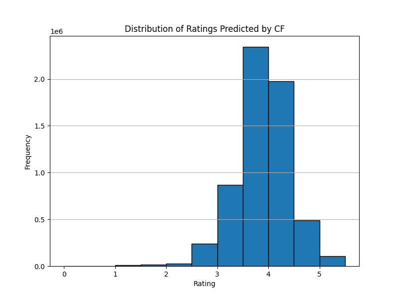
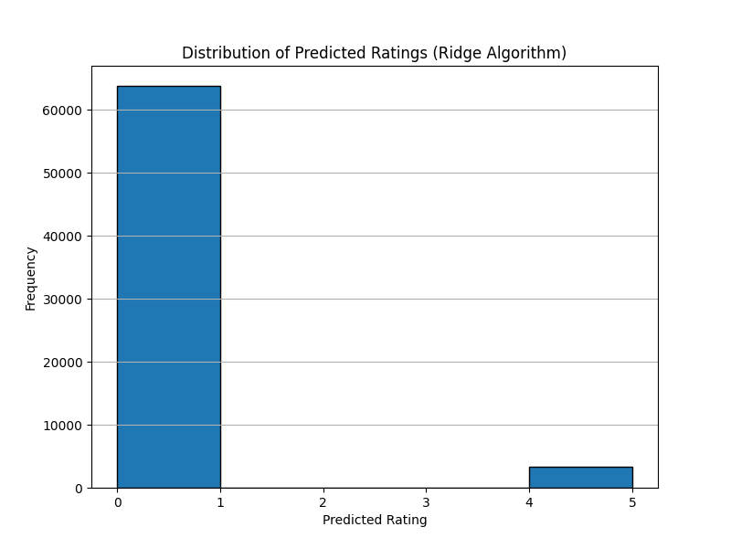
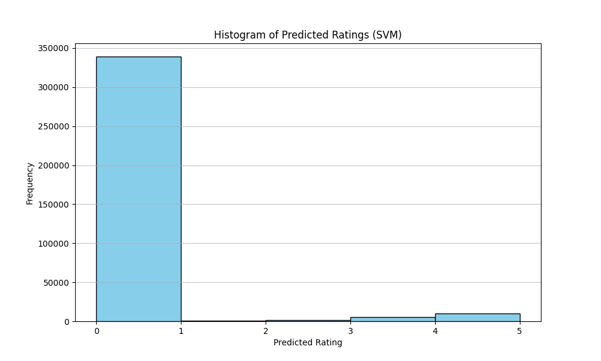

# 🎬 Movie Recommendation System: Predicting User Preferences
This project was developed as part of the 2025 CompuFlair Data Science bootcamp.

## Overview

This project implements a **Movie Recommendation System** using multiple machine learning models, including **Collaborative Filtering Neural Networks (CFNN)**, **Ridge Regression**, and **Support Vector Machines (SVM)**. The system predicts user preferences based on sparse user-item matrices and provides personalized movie recommendations.

---

## Features

1. **Collaborative Filtering Neural Network (CFNN)**:
   - Learns latent features for users and movies.
   - Handles sparse user-item matrices effectively.
   - Predicts ratings and recommends top movies for each user.

2. **Ridge Regression**:
   - Predicts movie preferences using regularized linear regression.
   - Focuses on threshold-based ratings.

3. **Support Vector Machines (SVM)**:
   - Classifies ratings into categories (above threshold, below threshold, missing).
   - Iteratively refines predictions until convergence.

4. **Utility Functions**:
   - Includes helper functions for data preprocessing, evaluation metrics, and similarity calculations.

---

## Figures

### 1. **CF Predicted Ratings Histogram**
A histogram showing the distribution of predicted ratings across all users. This model predicts ratings in multiples of 0.5.



### 2. **Ridge Regression Predicted Ratings Histogram**
A histogram showing the bimodal distribution of predicted ratings using Ridge Regression. This model predicts continuous ratings in the range 0-5, but most ratings are concentrated near 0.0 or 5.0. This is a result of the ALS factorization model, which focuses primarily on predicting ratings for preferred films (near 5.0), while ignoring the rest.



### 3. **SVM Classification Results**
A confusion matrix visualizing the performance of the SVM model in classifying ratings into categories.

*(You can generate this figure using `sklearn.metrics.plot_confusion_matrix`.)*

---

## Models

### 1. `nn.py`

**Purpose**:
- Defines the architecture for the Collaborative Filtering Neural Network (CFNN).
- Predicts ratings for user-movie pairs and recommends top movies.

**Key Features**:
- **Embedding Layers**: Learn latent features for users and movies.
- **Hidden Layers**: Model complex interactions using fully connected layers.
- **Output Layer**: Predicts ratings scaled to match the original range (e.g., 0.5 to 5.0).
- **Regularization**: Prevents overfitting using dropout and weight decay.

**Customization Options**:
- Modify embedding dimensions to control latent feature size.
- Adjust hidden layer sizes and activation functions.
- Change the optimizer (e.g., Adam, SGD) and learning rate.

---

### 2. `ridge_regression.py`

**Purpose**:
- Implements Ridge Regression to predict movie ratings based on user-item matrices.
- Regularizes the model to prevent overfitting and improve generalization.

**Key Features**:
- **Regularization**: Uses L2 regularization to penalize large coefficients and reduce model complexity.
- **Threshold-Based Predictions**: Predicts ratings and categorizes them into thresholds (e.g., high, medium, low).
- **Scalability**: Efficiently handles sparse matrices for large datasets.

**How to Run**:
```bash
python ridge_regression.py
```

**Dependencies**:
```bash
pip install numpy
```

**Customization Options**:
- Adjust the regularization parameter (`alpha`) to control the strength of regularization.
- Modify the threshold values to refine rating categories.

**Suggested Visualizations**:
1. **Predicted Ratings Histogram**:
   - Visualize the distribution of predicted ratings across all users.
   - Helps identify patterns such as bimodal distributions or skewness.

2. **Residuals Plot**:
   - Plot residuals (actual ratings - predicted ratings) to evaluate model fit.
   - Residuals should ideally be randomly distributed around zero.

---

### 3. `svm.py`

**Purpose**:
- Uses Support Vector Machines (SVM) to classify movie ratings into categories.
- Focuses on separating ratings into distinct classes (e.g., above threshold, below threshold, missing).

**Key Features**:
- **Classification**: Predicts discrete categories for ratings rather than continuous values.
- **Kernel Methods**: Supports linear and non-linear kernels (e.g., RBF) for flexible decision boundaries.
- **Iterative Refinement**: Refines predictions iteratively until convergence.

**How to Run**:
```bash
python svm.py
```

**Dependencies**:
```bash
pip install scikit-learn
```

**Customization Options**:
- Change the kernel type (`linear`, `rbf`, etc.) to experiment with different decision boundaries.
- Adjust hyperparameters such as `C` (regularization strength) and `gamma` (kernel coefficient) for better performance.

**Suggested Visualizations**:
1. **Confusion Matrix**:
   - Visualize classification performance using a confusion matrix.
   - Shows how well the model predicts each category.

2. **Precision-Recall Curve**:
   - Evaluate the trade-off between precision and recall for imbalanced datasets.
   - Useful for understanding the model's performance in predicting specific categories.

---

## Comparison of Results

### CFNN Recommendations:
```
Clerks (1994)
Shallow Grave (1994)
Highlander III: The Sorcerer (1994)
In the Line of Fire (1993)
Santa Clause, The (1994)
```

### Ridge Regression Recommendations:
```
Dunston Checks In (1996)
Sudden Death (1995)
Don't Be a Menace to South Central While Drinking Your Juice in the Hood (1996)
Dead Presidents (1995)
Balto (1995)
```

### SVM Recommendations:
```
Savage Nights (1992)
It Takes Two (1995)
Secret Garden, The (1993)
Hoop Dreams (1994)
The Glass Shield (1994)
```

---

## 📌 Notes

- All data files should reside in the `data/` directory.
- Execute models independently to compare results.
- Output predictions or evaluation results will typically be printed to the console or saved as files.

Feel free to adapt file parameters and code structures to fine-tune model performance.

---

## Figures

#### CF - Predicted Ratings


#### Ridge Regression - Predicted Ratings:


#### SVM - Predicted Ratings:


#### SVM - Confusion Matrix:


